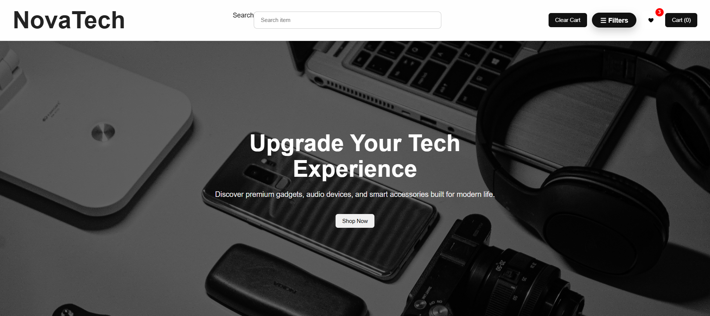
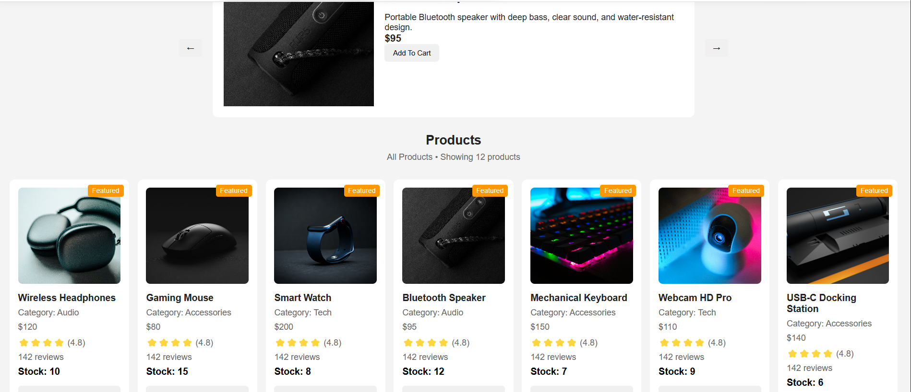
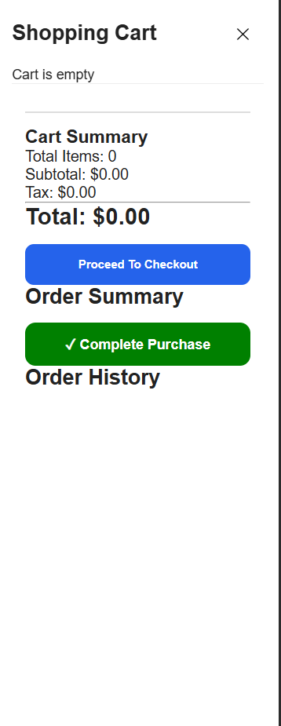

# 🛍 NovaTech E-Commerce Store

A modern, fully responsive e-commerce web application built with **HTML, CSS, and Vanilla JavaScript**.  
Designed to simulate a real-world shopping experience with cart, wishlist, filtering, and checkout functionality.

---

## 🔴 Live Demo
👉https://stephen-dev700.github.io/novatech-ecommerce-store/

---

## ✨ Key Features

- 🛒 Fully functional shopping cart system
- ❤️ Wishlist system (save products for later)
- 🔍 Real-time search functionality
- 🎯 Category filtering system
- ↕️ Sorting (price: low → high / high → low)
- 💳 Checkout flow with order confirmation
- 📦 Product stock management logic
- 💾 LocalStorage persistence (cart & wishlist saved)
- 📱 Fully responsive (mobile + desktop)
- ⚡ Smooth UI animations & interactions
- 📢 Toast notifications for user actions

---

## 🧠 What I Learned

This project helped me understand:

- State management in Vanilla JavaScript
- DOM manipulation at scale
- LocalStorage persistence techniques
- UI/UX design structure for e-commerce apps
- Modular JavaScript architecture
- Real-world frontend logic handling

---

## 🛠 Tech Stack

- HTML5
- CSS3 (Flexbox + Grid)
- Vanilla JavaScript (ES6+)

---

## 📸 Screenshots

### 🏠 Homepage

### 🛍 Products Section

### 🛒 Cart View

---

## 📂 Project Structure
NovaTech/
│
├── index.html
├── style.css
├── script.js
├── product.js
├── images/
└── README.md

---

## 🚀 Future Improvements

- Add backend (Node.js / Express)
- Add authentication system
- Integrate payment gateway
- Convert to React version
- Add admin dashboard

---

## 👨‍💻 Author

**Stephen Ilesanmi**  
Web Developer | UI/UX Enthusiast | Builder of Practical Web Apps

---

## ⭐ If you like this project

Feel free to star the repo ⭐ and follow my journey in web development.
